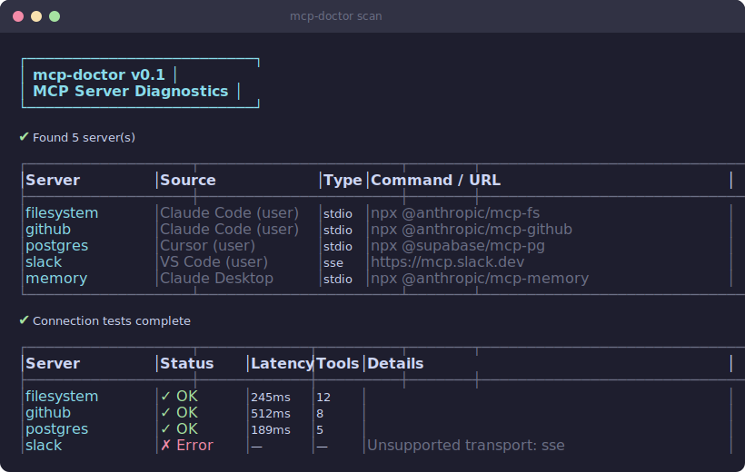

[](LICENSE)
[](https://nodejs.org)
[](https://www.npmjs.com/package/@wigu/mcp-doctor)
[](https://www.npmjs.com/package/@wigu/mcp-doctor)

# mcp-doctor

**Diagnose, secure, and benchmark your MCP servers.**

Zero-config CLI that auto-discovers MCP server configs across Claude Code, Cursor, VS Code, Windsurf, and Claude Desktop — then tests connections, flags security issues, and benchmarks latency in seconds.

<p align="center">
  
</p>

## Why?

MCP servers are becoming the backbone of AI-assisted development. But as you add more servers across more tools, things break silently:

- **Servers go down** and you don't notice until a tool call fails mid-conversation
- **Secrets leak** — API keys hardcoded in config files, tokens visible in process args
- **Slow servers** drag down your entire AI workflow without you realizing it
- **Configs drift** between tools — what works in Cursor might be broken in Claude Desktop

mcp-doctor gives you a single command to check everything, across every tool, in seconds.

## Quick Start

```bash
npx @wigu/mcp-doctor doctor
```

That's it. No config needed — it finds your servers automatically.

## Commands

| Command | Description |
| ------- | ----------- |
| `doctor` | Run all checks at once (scan + security + bench) |
| `scan` | Test all MCP server connections |
| `security` | Audit configs for security issues |
| `bench` | Benchmark server response times |
| `serve` | Run as an MCP server (stdio transport) |

All commands support `--json` for machine-readable output.

### `doctor` — Full checkup (recommended)

Runs scan, security, and bench in one go and prints a summary.

```bash
mcp-doctor doctor

# JSON output for CI/scripts
mcp-doctor doctor --json
```

### `scan` — Test all MCP server connections

Discovers configs and verifies each server responds to a JSON-RPC handshake.

```
$ mcp-doctor scan

  ┌─────────────────────────────────────────┐
  │           mcp-doctor v0.3.0             │
  │   Diagnose · Secure · Benchmark         │
  └─────────────────────────────────────────┘

  ✔ Found 3 server(s)

  ┌──────────────┬────────────┬─────────┐
  │ Server       │ Source     │ Status  │
  ├──────────────┼────────────┼─────────┤
  │ filesystem   │ Claude     │ ✔ OK    │
  │ postgres     │ Cursor     │ ✔ OK    │
  │ slack        │ VS Code    │ ✘ FAIL  │
  └──────────────┴────────────┴─────────┘
```

### `security` — Audit configs for security issues

Checks for leaked secrets, overly broad permissions, and risky command patterns.

```
$ mcp-doctor security

  ⚠  2 issues found

  ┌──────────┬──────────┬───────────────────────────────┐
  │ Severity │ Server   │ Issue                         │
  ├──────────┼──────────┼───────────────────────────────┤
  │ HIGH     │ postgres │ Plaintext password in config  │
  │ MEDIUM   │ slack    │ Token visible in args         │
  └──────────┴──────────┴───────────────────────────────┘
```

### `bench` — Benchmark server response times

Measures JSON-RPC round-trip latency for every configured server.

```
$ mcp-doctor bench

  ┌──────────────┬──────────┬────────┐
  │ Server       │ Latency  │ Rating │
  ├──────────────┼──────────┼────────┤
  │ filesystem   │ 12ms     │ fast   │
  │ postgres     │ 87ms     │ ok     │
  │ slack        │ timeout  │ —      │
  └──────────────┴──────────┴────────┘
```

## MCP Server Mode

mcp-doctor can also run **as an MCP server itself**, exposing `scan`, `security`, `bench`, and `doctor` as tools your AI assistant can call directly.

```json
{
  "mcpServers": {
    "mcp-doctor": {
      "command": "npx",
      "args": ["@wigu/mcp-doctor"]
    }
  }
}
```

When invoked without arguments and stdin is piped, it automatically starts in server mode using stdio transport. You can also explicitly run:

```bash
mcp-doctor serve
```

This means your AI assistant can diagnose its own MCP infrastructure on demand.

## GitHub Action

Use mcp-doctor in CI to catch broken servers and leaked secrets automatically:

```yaml
- name: Check MCP servers
  uses: realwigu/mcp-doctor@main
  with:
    command: doctor
    fail-on-error: "true"
```

The action outputs JSON via `${{ steps.mcp-doctor.outputs.result }}` for downstream processing.

## JSON Output

All commands support `--json` for structured output — useful for CI pipelines, dashboards, or scripting:

```bash
mcp-doctor doctor --json | jq '.summary'
```

```json
{
  "servers": 3,
  "healthy": 2,
  "securityIssues": 1,
  "avgLatencyMs": 45
}
```

## Supported Tools

| Tool            | Config Auto-Detected |
| --------------- | -------------------- |
| Claude Code     | ✅                    |
| Claude Desktop  | ✅                    |
| Cursor          | ✅                    |
| VS Code         | ✅                    |
| Windsurf        | ✅                    |

mcp-doctor reads each tool's config file from its standard location and merges all discovered servers into a single view.

## What It Checks

- **Connection health** — JSON-RPC `initialize` handshake against every server
- **Security issues** — plaintext secrets, tokens in args, dangerous shell commands
- **Latency benchmarks** — round-trip timing with fast / ok / slow ratings

## Install

```bash
# Run directly (no install needed)
npx @wigu/mcp-doctor scan

# Or install globally
npm install -g @wigu/mcp-doctor
mcp-doctor scan
```

Requires **Node.js 18+**.

## Contributing

Contributions are welcome! Open an issue or submit a pull request.

1. Fork the repo
2. Create a feature branch (`git checkout -b my-feature`)
3. Commit your changes
4. Open a PR

## License

[MIT](LICENSE)
